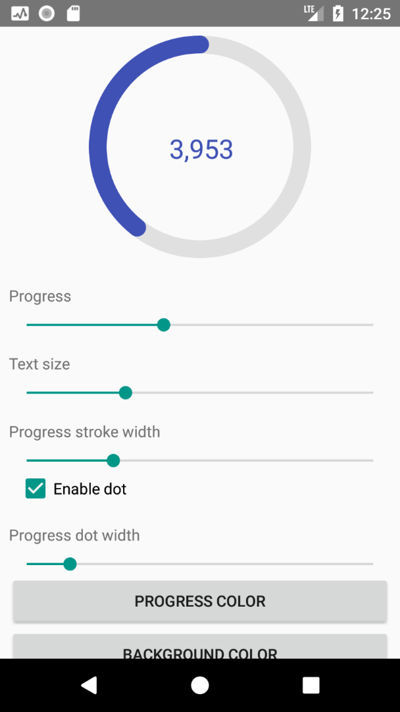
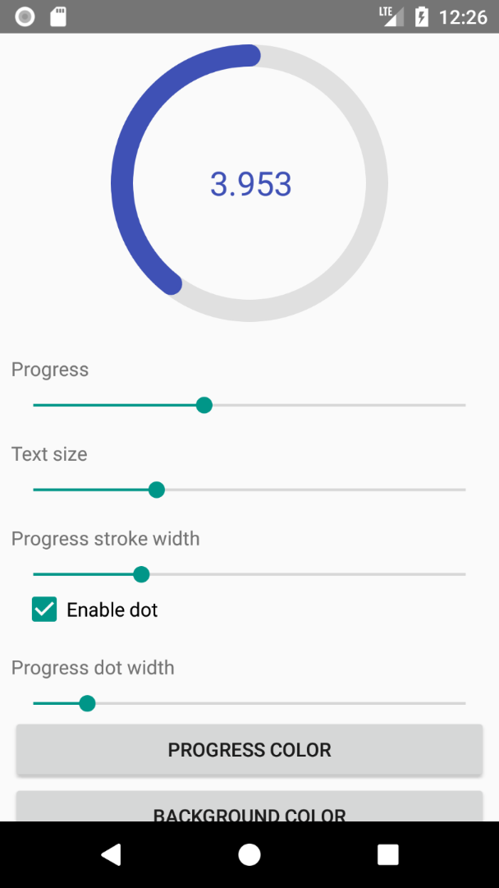

# CircularProgressIndicator

Simple but customizable view for displaying progress

  


##### With custom delimiters or without delimiter
  <br/>
 


##### With custom colors
 


##### With or without dot
 


##### With custom progress text prefix/suffix or both
  


## How to use

Add view to your layout:
```xml
<antonkozyriatskyi.circularprogressindicator.CircularProgressIndicator
    android:id="@+id/circular_progress"
    android:layout_width="200dp"
    android:layout_height="200dp"
    android:layout_gravity="center"
    android:layout_marginBottom="8dp"
    android:layout_marginTop="8dp"
    app:progressColor="@color/colorPrimary"
    app:progressBackgroundColor="#efefefef"
    app:progressStrokeWidth="8dp"
    app:drawDot="true"
    app:dotColor="@color/colorAccent"
    app:dotWidth="16dp"
    app:textSize="24sp"
    app:textColor="@color/colorPrimaryDark"
    app:useProgressTextDelimiter="true"
    app:progressTextDelimiter="."
    app:progressTextPrefix="$"
    app:progressTextSuffix="%" />
```

Since all attributes have default values, you can specify none of them. Thus following code also works:
```xml
<antonkozyriatskyi.circularprogressindicator.CircularProgressIndicator
    android:id="@+id/circular_progress"
    android:layout_width="200dp"
    android:layout_height="200dp"
    android:layout_gravity="center"
    android:layout_marginBottom="8dp"
    android:layout_marginTop="8dp" />
```


Than find it in code and set progress:
```java
CircularProgressIndicator circularProgress = findViewById(R.id.circular_progress);

// you can set max and current progress values individually
circularProgress.setMaxProgress(10000);
circularProgress.setCurrentProgress(5000);
// or all at once
circularProgress.setProgress(5000, 10000);

// you can get progress values using following getters
circularProgress.getProgress() // returns 5000
circularProgress.getMaxProgress() // returns 10000
```

#### Attributes
|  Description                                        | XML                               | Java                                                                                                                                                    | Default value                 |
|  -------------------------------------------------- | --------------------------------- | ------------------------------------------------------------------------------------------------------------------------------------------------------- | ----------------------------- |
|  Progress color                                     | `app:progressColor`               | setter: `setProgressColor(color)`<br>getter: `getProgressColor()`                                                                                       | `#3f51b5`                     |
|  Progress background  color                         | `app:progressBackgroundColor`     | setter: `setProgressBackgroundColor(color)`<br>getter: `getProgressBackgroundColor()`                                                                   | `#e0e0e0`                     |
|  Width of progress stroke                           | `app:progressStrokeWidth`         | setters: `setProgressStrokeWidthDp(widthInDp)` or `setProgressStrokeWidthPx(widthInPx)`<br>getter: `getProgressStrokeWidth()` (returns width in pixels) | `8dp`                         |
|  Whether to draw dot. `true` or `false`             | `app:drawDot`                     | setter: `setShouldDrawDot(shoulDrawDot)`<br>getter: `isDotEnabled()`                                                                                    |  `true`                       |
|  Dot color                                          | `app:dotColor`                    | setter: `setDotColor(dotColor)`<br>getter: `getDotColor()`                                                                                              | same as progress color        |
|  Dot width                                          | `app:dotWidth`                    | setters: `setDotWidthDp(widthInDp)` or `setDotWidthPx(widthInPx)`<br>getter: `getDotWidth()` (returns width in pixels)                                  | same as progress stroke width |
|  Progress text size                                 | `app:textSize`                    | setters: `setTextSizeSp(sizeInSp)` or `setTextSizePx(sizeInPx)`<br>getter: `getTextSize()` (returns size in pixels)                                     | `24sp`                        |
|  Progress text color                                | `app:textColor`                   | setter: `setTextColor(textColor)`<br>getter: `getTextColor()`                                                                                           | same as progress color        |
|  Whether to use delimiter or not. `true` or `false` | `app:useProgressTextDelimiter`    | setter: `setShouldUseDelimiter(shouldUseDelimiter)`<br>getter: `isTextDelimiterEnabled()`                                                               | `true`                        |
|  The delimiter to use in progress text              | `app:progressTextDelimiter`       | setter: `setProgressTextDelimiter(delimiter)`<br>getter: `getProgressTextDelimiter()`                                                                   | `,`                           |
|  Prefix for progress text                           | `app:progressTextPrefix`          | setter: `setProgressTextPrefix(prefix)`<br>getter: `getProgressTextPrefix()`                                                                            | `null` (disabled)             |
|  Suffix for progress text                           | `app:progressTextSuffix`          | setter: `setProgressTextSuffix(suffix)`<br>getter: `getProgressTextSuffix()`                                                                            | `null` (disabled)             |

---

### Download using Gradle

Add this in your root build.gradle at the end of repositories:
```groovy
allprojects {
    repositories {
        maven { url 'https://jitpack.io' }
    }
}
```

Add this dependency to your dependencies block:
```groovy
implementation 'com.github.antonKozyriatskyi:CircularProgressIndicator:1.0.4'
```

### License

```
 Copyright 2018 Anton Kozyriatskyi

   Licensed under the Apache License, Version 2.0 (the "License");
   you may not use this file except in compliance with the License.
   You may obtain a copy of the License at

       http://www.apache.org/licenses/LICENSE-2.0

   Unless required by applicable law or agreed to in writing, software
   distributed under the License is distributed on an "AS IS" BASIS,
   WITHOUT WARRANTIES OR CONDITIONS OF ANY KIND, either express or implied.
   See the License for the specific language governing permissions and
   limitations under the License.
```
