# CircularProgressIndicator

Simple but customizable view for displaying progress

 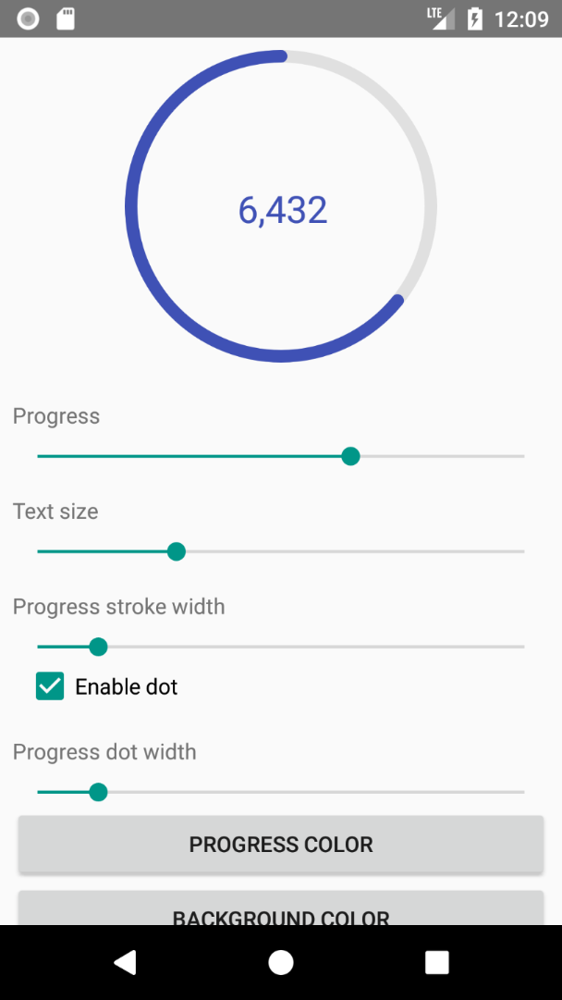 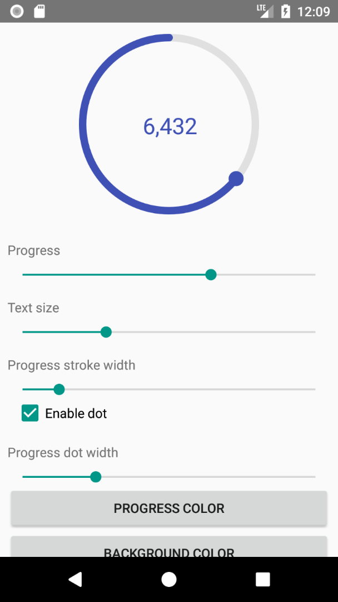


##### With custom colors
 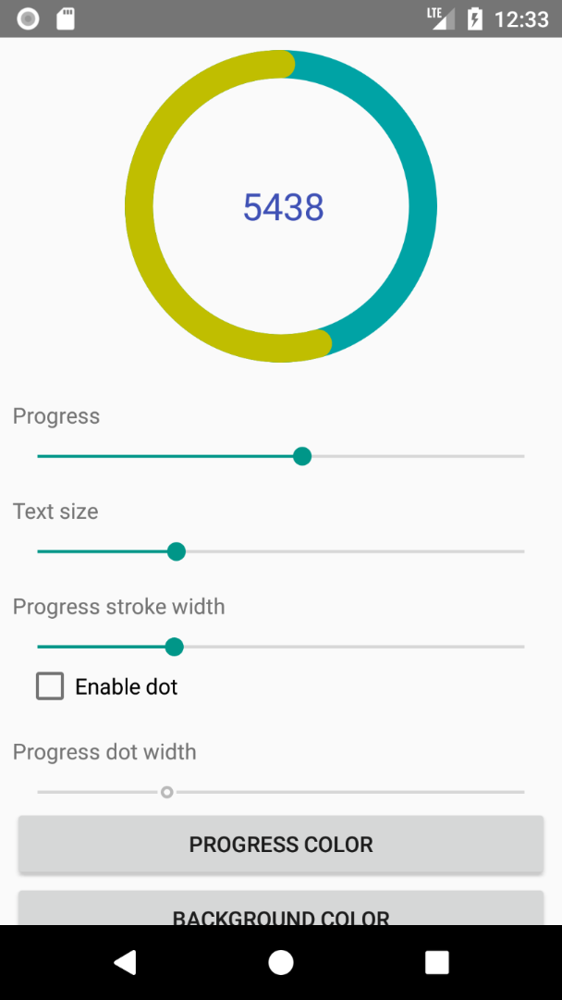


##### With or without dot
 


##### With custom progress text (more examples [here](#formatting-progress-text))
  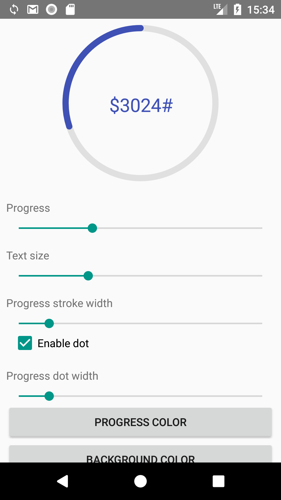


##### With clockwise direction
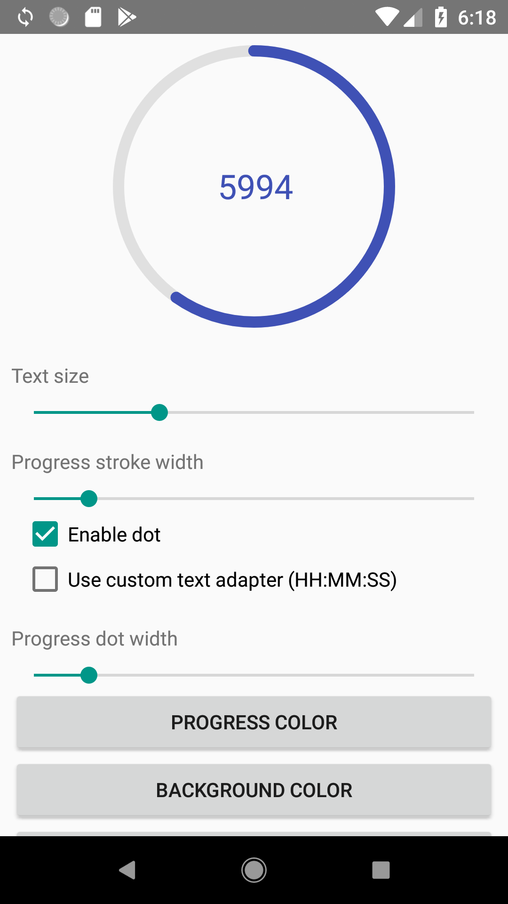

##### With custom start angle (details [here](#setting-start-angle))
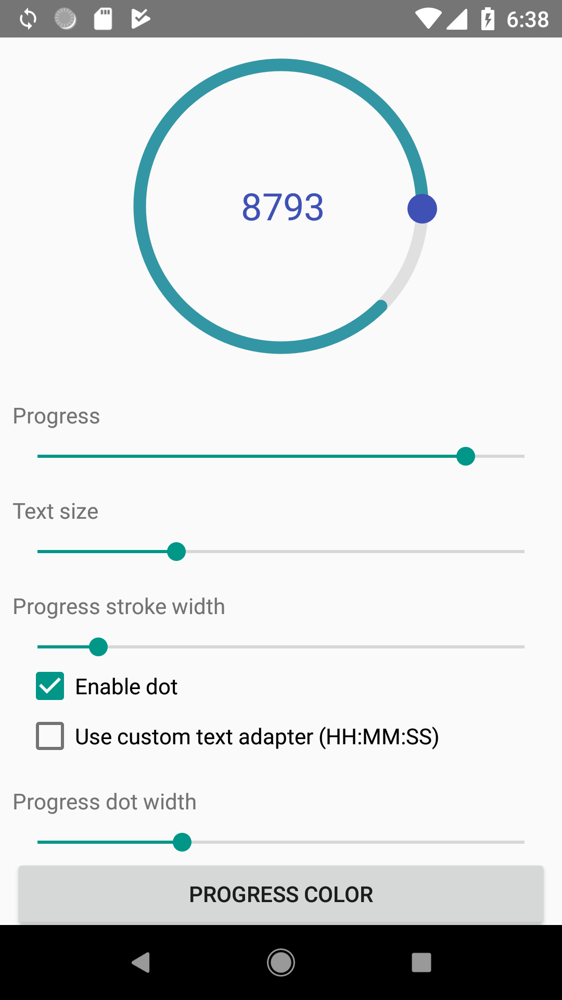 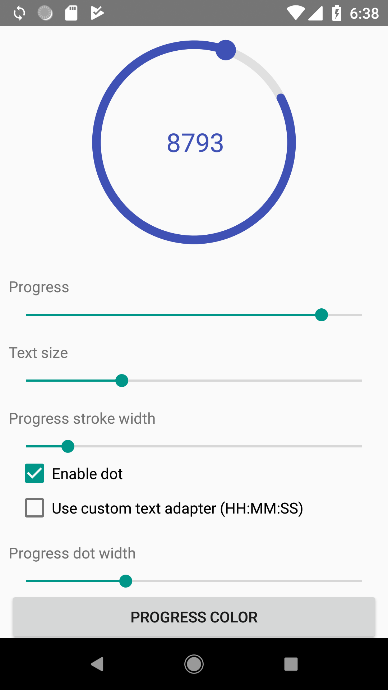

##### With custom progress cap (details [here](#setting-start-angle))
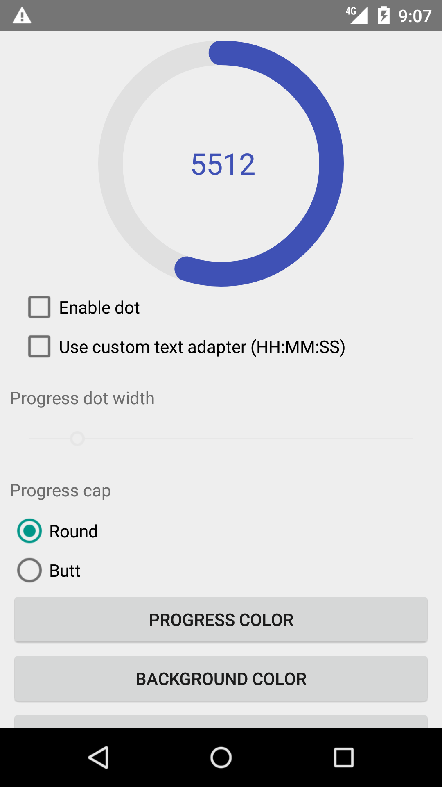 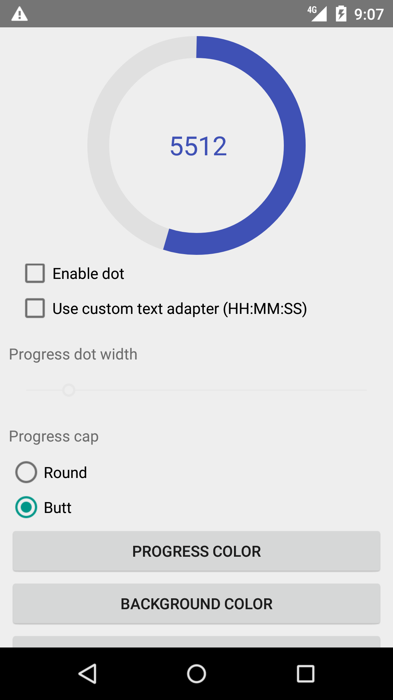

##### With different progress foreground and background rings' width
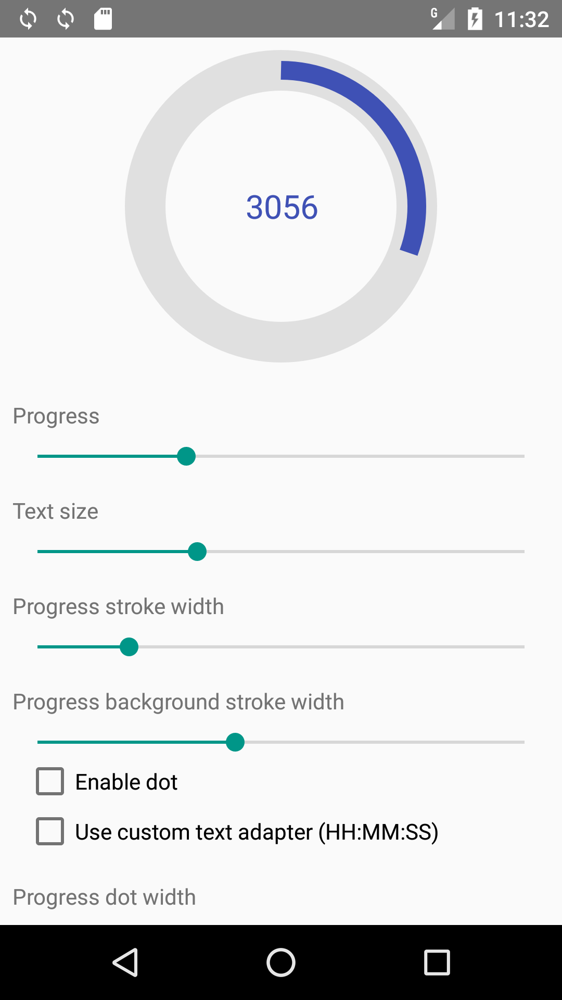 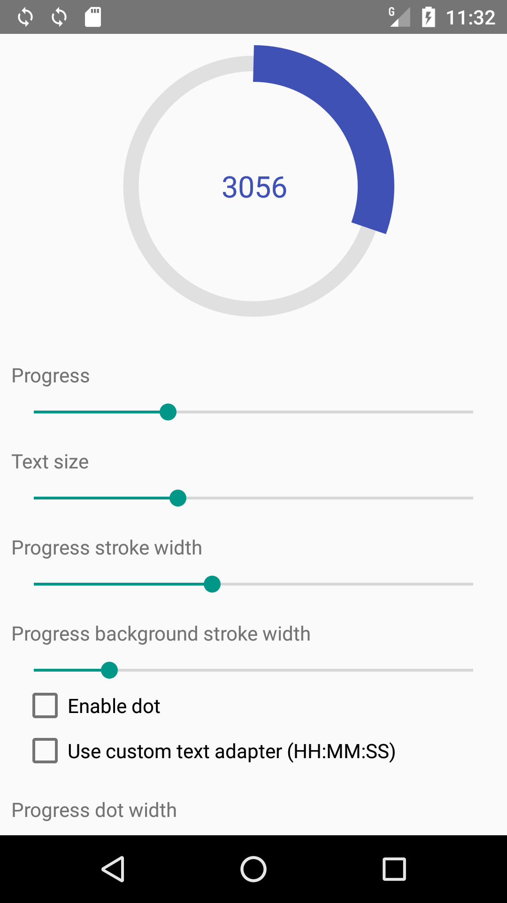

##### With background filling enabled/disabled
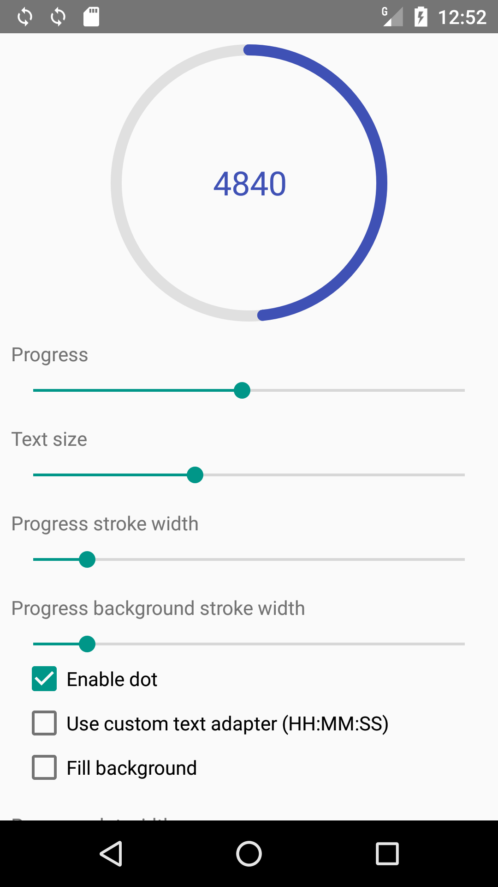 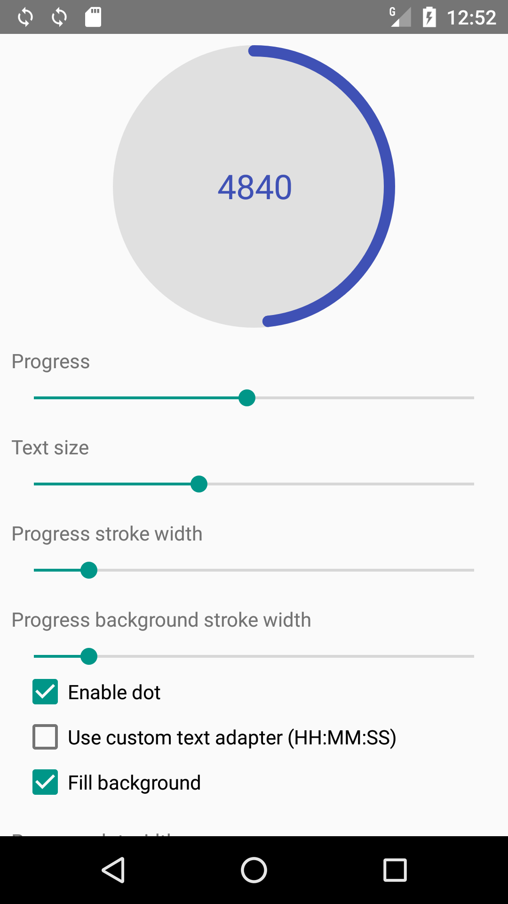 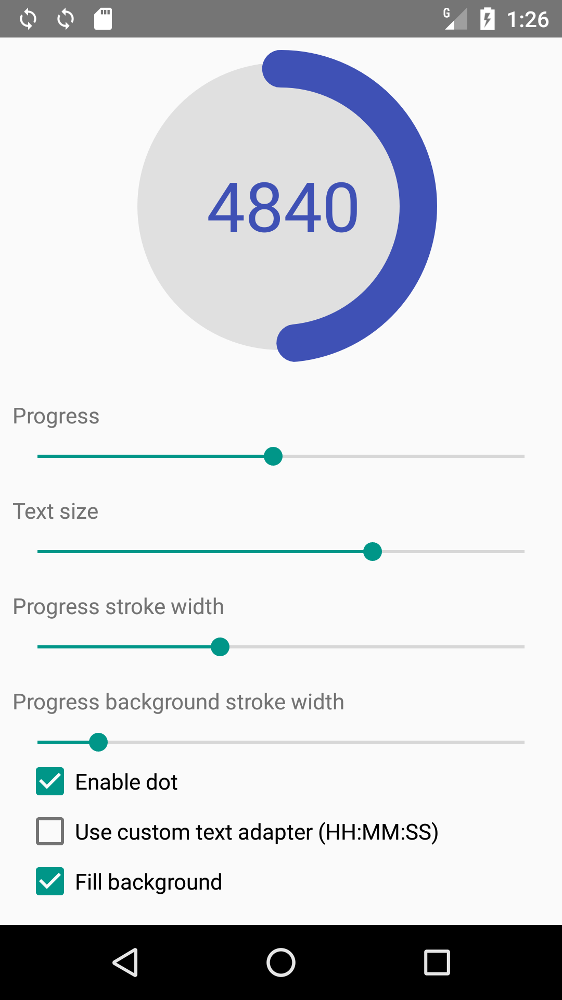

##### With gradients [linear, sweep and radial] (details [here](#gradients))
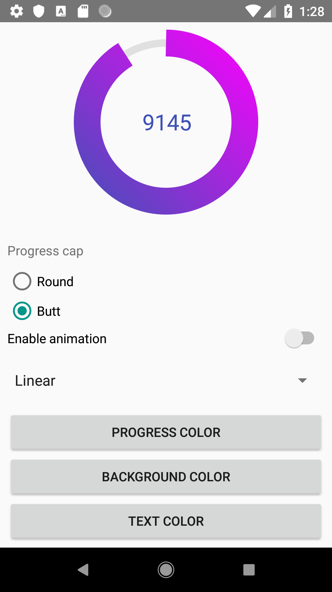 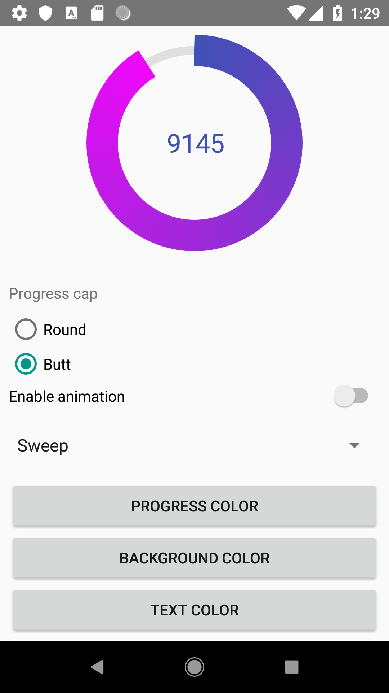 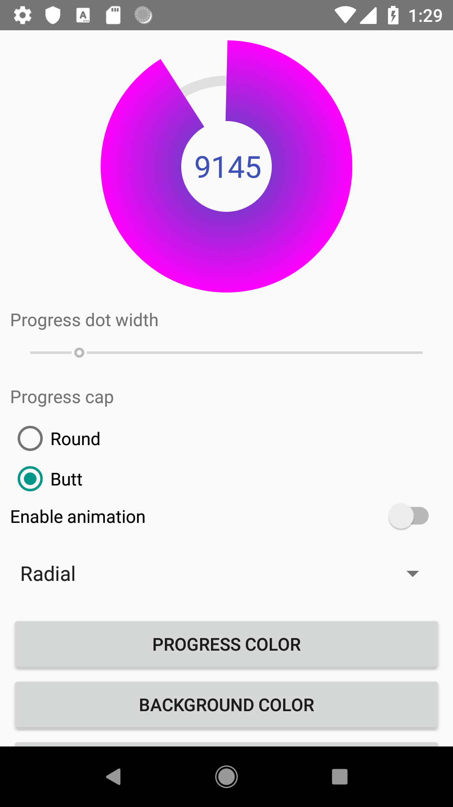


## How to use

Add view to your layout:
```xml
<antonkozyriatskyi.circularprogressindicator.CircularProgressIndicator
        android:id="@+id/circular_progress"
        android:layout_width="200dp"
        android:layout_height="200dp"
        android:layout_gravity="center"
        android:layout_marginBottom="8dp"
        android:layout_marginTop="8dp"
        app:direction="clockwise"
        app:dotColor="?colorPrimary"
        app:dotWidth="16dp"
        app:drawDot="true"
        app:enableProgressAnimation="true"
        app:formattingPattern="&#37;d"
        app:progressBackgroundColor="?colorAccent"
        app:progressBackgroundStrokeWidth="8dp"
        app:progressCap="round"
        app:progressColor="?colorPrimary"
        app:progressStrokeWidth="16dp"
        app:startAngle="270"
        app:textColor="#fffc59"
        app:textSize="14sp"
        app:fillBackground="false"
        app:gradientType="linear"
        app:gradientEndColor="@color/colorAccent" />
```

Since all attributes have default values, you can specify none of them. Thus following code also works:
```xml
<antonkozyriatskyi.circularprogressindicator.CircularProgressIndicator
    android:id="@+id/circular_progress"
    android:layout_width="200dp"
    android:layout_height="200dp"
    android:layout_gravity="center"
    android:layout_marginBottom="8dp"
    android:layout_marginTop="8dp" />
```


Than find it in code and set progress:
```java
CircularProgressIndicator circularProgress = findViewById(R.id.circular_progress);

// you can set max and current progress values individually
circularProgress.setMaxProgress(10000);
circularProgress.setCurrentProgress(5000);
// or all at once
circularProgress.setProgress(5000, 10000);

// you can get progress values using following getters
circularProgress.getProgress() // returns 5000
circularProgress.getMaxProgress() // returns 10000
```

#### Attributes
|  Description                                                                                                                                        | XML                                  | Java                                                                                                                                                                                     | Default value                 |
|  -------------------------------------------------------------------------------------------------------------------------------------------------- | ------------------------------------ | ---------------------------------------------------------------------------------------------------------------------------------------------------------------------------------------- | ----------------------------- |
|  Progress color                                                                                                                                     | `app:progressColor`                  | setter: `setProgressColor(color)`<br/>getter: `getProgressColor()`                                                                                                                       | `#3f51b5`                     |
|  Progress background color                                                                                                                          | `app:progressBackgroundColor`        | setter: `setProgressBackgroundColor(color)`<br/>getter: `getProgressBackgroundColor()`                                                                                                   | `#e0e0e0`                     |
|  Width of progress stroke                                                                                                                           | `app:progressStrokeWidth`            | setters: `setProgressStrokeWidthDp(widthInDp)` or `setProgressStrokeWidthPx(widthInPx)`<br/>getter: `getProgressStrokeWidth()` (returns width in pixels)                                 | `8dp`                         |
|  Width of progress background stroke                                                                                                                | `app:progressBackgroundStrokeWidth`  | setters: `setProgressBackgroundStrokeWidthDp(widthInDp)` or `setProgressBackgroundStrokeWidthPx(widthInPx)`<br/>getter: `getProgressBackgroundStrokeWidth()` (returns width in pixels)   | same as progress width        |
|  Whether to draw dot. `true` or `false`                                                                                                             | `app:drawDot`                        | setter: `setShouldDrawDot(shoulDrawDot)`<br/>getter: `isDotEnabled()`                                                                                                                    | `true`                        |
|  Dot color                                                                                                                                          | `app:dotColor`                       | setter: `setDotColor(dotColor)`<br/>getter: `getDotColor()`                                                                                                                              | same as progress color        |
|  Dot width                                                                                                                                          | `app:dotWidth`                       | setters: `setDotWidthDp(widthInDp)` or `setDotWidthPx(widthInPx)`<br/>getter: `getDotWidth()` (returns width in pixels)                                                                  | same as progress stroke width |
|  Progress text size                                                                                                                                 | `app:textSize`                       | setters: `setTextSizeSp(sizeInSp)` or `setTextSizePx(sizeInPx)`<br/>getter: `getTextSize()` (returns size in pixels)                                                                     | `24sp`                        |
|  Progress text color                                                                                                                                | `app:textColor`                      | setter: `setTextColor(textColor)`<br/>getter: `getTextColor()`                                                                                                                           | same as progress color        |
|  Formatting pattern to be used in `PatternProgressTextAdapter`. Checkout [Formatting progress text](#formatting-progress-text) section.             | `app:formattingPattern`              | setter: `setProgressTextAdapter(progressTextAdapter)`<br/>getter: `getProgressTextAdapter()`                                                                                             | not specified                 |
|  Direction of the progress arc (`clockwise` or `counterclockwise`)                                                                                  | `app:direction`                      | setter: `setDirection(direction)`<br/>getter: `getDirection()`                                                                                                                           | `counterclockwise`            |
|  Start angle. Checkout [Start angle](#setting-start-angle) section.                                                                                 | `app:startAngle`                     | setter: `setStartAngle(startAngle)`<br/>getter: `getStartAngle()`                                                                                                                        | `270`                         |
|  Progress cap                                                                                                                                       | `app:progressCap`                    | setter: `setProgressStrokeCap(cap)`<br/>getter: `getProgressStrokeCap()`                                                                                                                 | `CAP_ROUND`                   |
|  Progress animation                                                                                                                                 | `app:enableProgressAnimation`        | setter: `setAnimationEnabled(enableAnimation)`<br/>getter: `isAnimationEnabled()`                                                                                                        | `true`                        |
|  Whether to fill background with progress background color                                                                                          | `app:fillBackground`                 | setter: `setFillBackgroundEnabled(enable)`<br/>getter: `isFillBackgroundEnabled()`                                                                                                       | `false`                       |
|  Gradient type                                                                                                                                      | `app:gradientType`                   | setter: `setGradient(type, color)`<br/>getter: `getGradientType()`                                                                                                                       | `no_gradient`                 |
|  End color of a gradient                                                                                                                            | `app:gradientEndColor`               | -                                                                                                                                                                                        | -                             |

---

#### Formatting progress text
Before version 1.0.5 formatting text was limited to specifying prefix, suffix and delimiter. Since version 1.1 you have full control over the text to be displayed (thanks to the [repitch](https://github.com/repitch) for the idea and implementation).
!!! Attributes `app:useProgressTextDelimiter`, `app:progressTextDelimiter`, `app:progressTextPrefix`, `app:progressTextSuffix` were removed in v1.1.3.

The only thing you have to do is to provide an implementation of `CircularProgressIndicator.ProgressTextAdapter`.
You must override it's `String formatText(double currentProgress);` method.
Library already provides you with two implementations:
* [DefaultProgressTextAdapter](circularprogressindicator/src/main/java/antonkozyriatskyi/circularprogressindicator/DefaultProgressTextAdapter.java) that just returns string representation of the progress value cast to `int`.
* [PatternProgressTextAdapter](circularprogressindicator/src/main/java/antonkozyriatskyi/circularprogressindicator/PatternProgressTextAdapter.java) that uses pattern specified in `formattingPattern` attribute to format progress (if it is set, otherwise it falls back to the `DefaultProgressTextAdapter`).

##### Custom formatters' examples

`DefaultProgressTextAdapter` is a default text adapter, which is used when no `formatterPattern` attribute set or `progressIndicator.setProgressTextAdapter(null)` method was called.
It's implementation looks like this:
```java
    @Override
    public String formatText(double currentProgress) {
        return String.valueOf((int) currentProgress);
    }
```


`PatternProgressTextAdapter` supports formatting progress using Java's [formatting patterns](https://docs.oracle.com/javase/7/docs/api/java/util/Formatter.html).
For example, if you want to display progress with two digits for the fractional part, you can use `%.2f` pattern and set it via

- attribute:   
   `app:formattingPattern="@string/pattern"` that refers to a string resource<br/>`<string name="pattern">%.2f</string>`<br/>
   If you don't want to use string resource - you have to use unicode for percent sign (`&#37;`) instead of sign itself:<br/>
   `app:formattingPattern="&#37;.2f"`
    
- or `PatternProgressTextAdapter`:
   `circularProgress.setProgressTextAdapter(new PatternProgressTextAdapter("%.2f"));`
   
Here is the example of `TimeTextAdapter` by [repitch](https://github.com/repitch) that displays text in format of 'HH.MM.SS'
```java
private static final CircularProgressIndicator.ProgressTextAdapter TIME_TEXT_ADAPTER = new CircularProgressIndicator.ProgressTextAdapter() {
        @Override
        public String formatText(double time) {
            int hours = (int) (time / 3600);
            time %= 3600;
            int minutes = (int) (time / 60);
            int seconds = (int) (time % 60);
            StringBuilder sb = new StringBuilder();
            if (hours < 10) {
                sb.append(0);
            }
            sb.append(hours).append(":");
            if (minutes < 10) {
                sb.append(0);
            }
            sb.append(minutes).append(":");
            if (seconds < 10) {
                sb.append(0);
            }
            sb.append(seconds);
            return sb.toString();
        }
    };
```

If you don't want any text to be displayed - just create your own `ProgressTextAdapter` that returns an empty string.

---

#### Setting start angle
You can specify start angle for the progress arc using `app:startAngle` attribute or `setStartAngle(startAngle)` method.
Acceptable values are from 0 to 360 degrees. But be aware that they go clockwise, so:
 - 0&deg; is at 3 o'clock as usual
 - 90&deg; is at 6 o'clock
 - 180&deg; is at 9 o'clock
 - 270&deg; is at 12 o'clock


###### Image taken from [Android Canvas' drawArc Method: A Visual Guide](https://robots.thoughtbot.com/android-canvas-drawarc-method-a-visual-guide) article.

---

#### Listening to progress changes
```java
circularProgress.setOnProgressChangeListener(new CircularProgressIndicator.OnProgressChangeListener() {
            @Override
            public void onProgressChanged(double progress, double maxProgress) {
                Log.d("PROGRESS", String.format("Current: %1$.0f, max: %2$.0f", progress, maxProgress));
            }
        });
```

---

#### Setting interpolator
Default interpolator used for running animation is `AccelerateDecelerateInterpolator`,
but you can set any other one using setter:
```java
circularProgress.setInterpolator(new LinearInterpolator());
```

---

#### Gradients
`CircularProgressIndicator` supports 3 types of gradient:
- Linear
- Radial (doesn't look really good)
- Sweep

They can be setup using attribute `app:gradientType"` that accepts 4 values:
- `linear`
- `radial`
- `sweep`
- `no_gradient`- default one, can also be used to remove gradient
You also must specify end color using `app:gradientEndColor="color|reference"` attribute.

Or you can set it in code:
```java
int endColor = Color.MAGENTA;

/* Must be one of:
*  - LINEAR_GRADIENT 
*  - RADIAL_GRADIENT 
*  - SWEEP_GRADIENT 
*  - NO_GRADIENT
* */
int gradientType = CircularProgressIndicator.LINEAR_GRADIENT;

circularProgress.setGradient(gradientType, endColor);

circularProgress.getGradientType(); //returns LINEAR_GRADIENT
```

---

### Download using Gradle

Add this in your root `build.gradle` at the end of `repositories` in `allprojects` section:
```groovy
allprojects {
    repositories {
        maven { url 'https://jitpack.io' }
    }
}
```

Then add this dependency to your **module-level** `build.gradle` in `dependencies` section:
```groovy
implementation 'com.github.antonKozyriatskyi:CircularProgressIndicator:1.3.0'
```

If you have any troubles downloading the library - checkout [issue#5](https://github.com/antonKozyriatskyi/CircularProgressIndicator/issues/5)

---

### License

```
 Copyright 2018 Anton Kozyriatskyi

   Licensed under the Apache License, Version 2.0 (the "License");
   you may not use this file except in compliance with the License.
   You may obtain a copy of the License at

       http://www.apache.org/licenses/LICENSE-2.0

   Unless required by applicable law or agreed to in writing, software
   distributed under the License is distributed on an "AS IS" BASIS,
   WITHOUT WARRANTIES OR CONDITIONS OF ANY KIND, either express or implied.
   See the License for the specific language governing permissions and
   limitations under the License.
```
